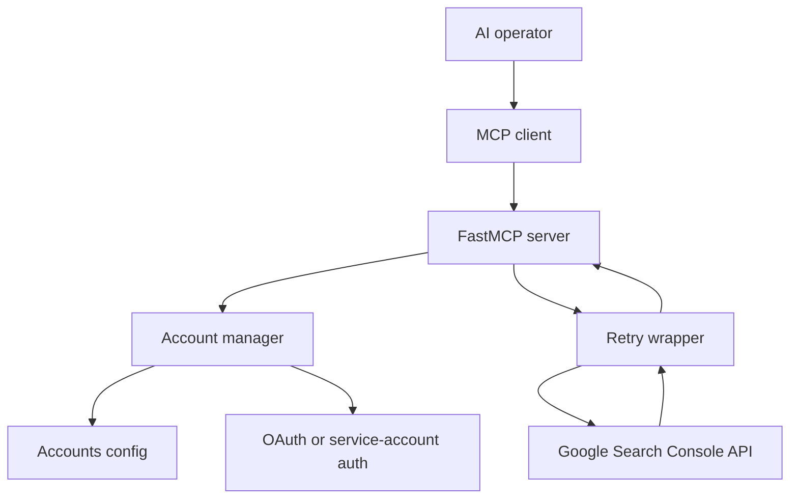
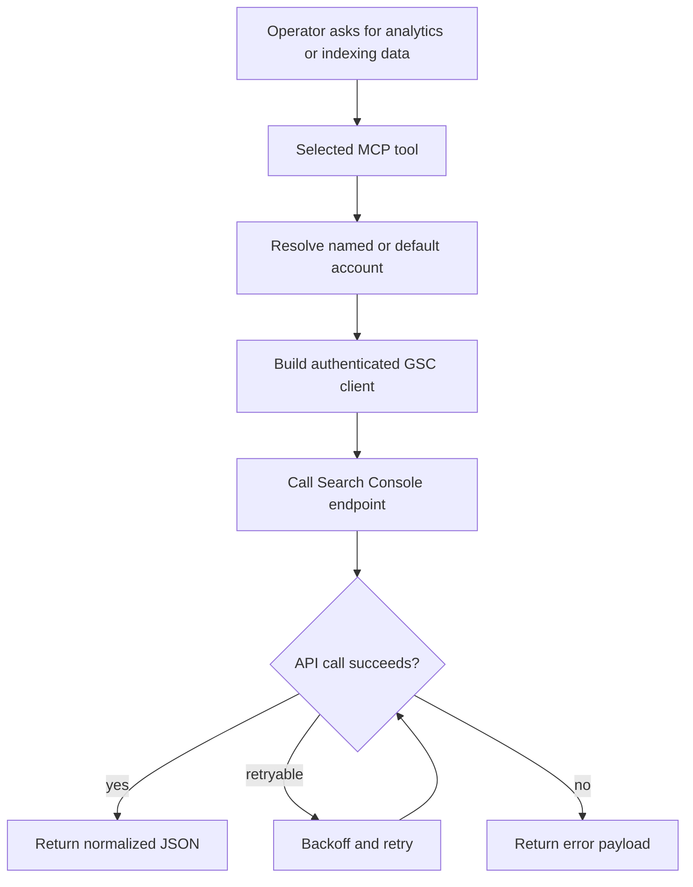

# mcp-search-console

Multi-account Google Search Console MCP server for operators who need one MCP surface across
multiple sites or clients without restarting the server.

Release posture: beta package, version `0.1.3` from [`pyproject.toml`](pyproject.toml).

## Choose your path

| You are... | Start here | Then |
|---|---|---|
| Connecting the server to Claude/Codex/Cursor | [docs/start-here.md](docs/start-here.md) | Quick start below |
| Auditing account routing or destructive guards | [docs/architecture.md](docs/architecture.md) | [`gsc/server.py`](gsc/server.py) |
| Reviewing packaging or registry metadata | [`pyproject.toml`](pyproject.toml) | [`server.json`](server.json) |

## Architecture



## Request flow



## Quick start

1. Install the package.

```bash
python -m pip install mcp-search-console-multi
```

2. Create the accounts config.

```bash
mkdir -p ~/.config/mcp-search-console
cp accounts.example.json ~/.config/mcp-search-console/accounts.json
```

3. Register it in your MCP client.

```json
{
  "mcpServers": {
    "search-console": {
      "command": "uvx",
      "args": ["mcp-search-console-multi"],
      "env": {
        "GSC_ACCOUNTS_CONFIG": "/Users/you/.config/mcp-search-console/accounts.json"
      }
    }
  }
}
```

## Available tools

| Tool group | Tools | Purpose |
|---|---|---|
| Account routing | `list_accounts`, `set_default_account`, `reauthenticate` | Inspect accounts, switch defaults, refresh auth |
| Property inventory | `list_properties`, `get_site_details` | Discover accessible properties and permissions |
| Search analytics | `get_search_analytics`, `get_performance_overview`, `compare_periods`, `get_advanced_search_analytics`, `get_search_by_page` | Query search-performance data |
| Inspection and sitemaps | `inspect_url`, `batch_inspect_urls`, `check_indexing_issues`, `list_sitemaps`, `get_sitemap`, `submit_sitemap`, `delete_sitemap` | Inspect indexing and manage sitemap submissions |

`submit_sitemap` and `delete_sitemap` stay behind the destructive flag documented in
[docs/start-here.md](docs/start-here.md).

## Runtime proof

| Claim | Proof |
|---|---|
| Package entry point is stable | `mcp-search-console-multi = "gsc.server:main"` in [`pyproject.toml`](pyproject.toml) |
| Multi-account routing is first-class | `AccountManager()` and `_get_manager()` in [`gsc/server.py`](gsc/server.py) |
| Search Console calls are retried | `with_retry()` in [`gsc/server.py`](gsc/server.py) and [`gsc/retry.py`](gsc/retry.py) |
| Auth is file-driven per account | [`accounts.example.json`](accounts.example.json) and [`gsc/accounts.py`](gsc/accounts.py) |

## Repo map

| Path | Purpose |
|---|---|
| [`gsc/server.py`](gsc/server.py) | FastMCP tool surface and response normalization |
| [`gsc/accounts.py`](gsc/accounts.py) | Account config, auth loading, client construction |
| [`gsc/auth/`](gsc/auth/) | OAuth and service-account auth implementations |
| [`gsc/retry.py`](gsc/retry.py) | Retry behavior for transient API failures |
| [`docs/start-here.md`](docs/start-here.md) | Setup, env, validation, common failures |
| [`docs/architecture.md`](docs/architecture.md) | Component map and runtime lifecycle |

## Validation

| Check | Command |
|---|---|
| Import compiles | `python -m compileall gsc` |
| Package builds | `python -m build` |
| README/docs links stay local | `rg '\\]\\(([^)]+\\.md)\\)' README.md docs/` |

## License

MIT

<!-- mcp-name: io.github.Ayo-Fam/mcp-search-console -->
