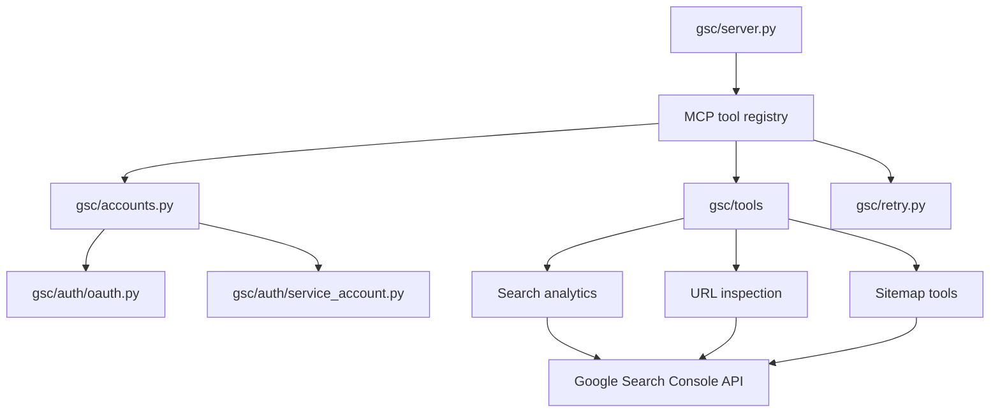
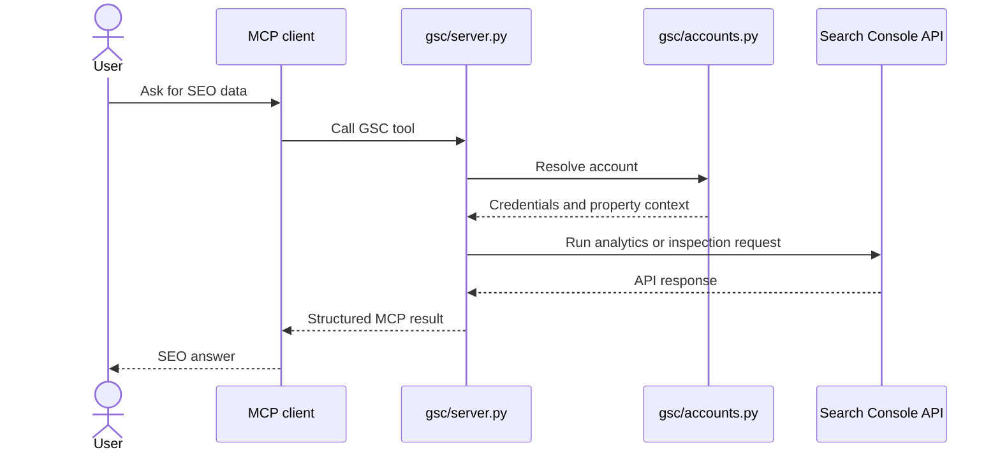

# Architecture

`mcp-search-console` is a Python MCP server around Google Search Console. It resolves a named
account, authenticates through OAuth or service-account credentials, calls the Search Console API,
and returns structured MCP results.

## Components

## Request Sequence

## Data Boundaries

| Data | Source | Storage |
|---|---|---|
| Account map | `accounts.json` based on `accounts.example.json` | Local config path. |
| OAuth client secrets | Google Cloud OAuth app | Local file path only. |
| OAuth token files | Generated during OAuth flow | Local file path only. |
| Service-account JSON | Google Cloud service account | Local or mounted config. |
| GSC data | Search Console API | Returned through MCP; not persisted here. |

## Extension Points

| Change | File |
|---|---|
| Add a new MCP tool | `gsc/server.py` or `gsc/tools/` |
| Add account behavior | `gsc/accounts.py` |
| Change OAuth flow | `gsc/auth/oauth.py` |
| Change service-account flow | `gsc/auth/service_account.py` |
